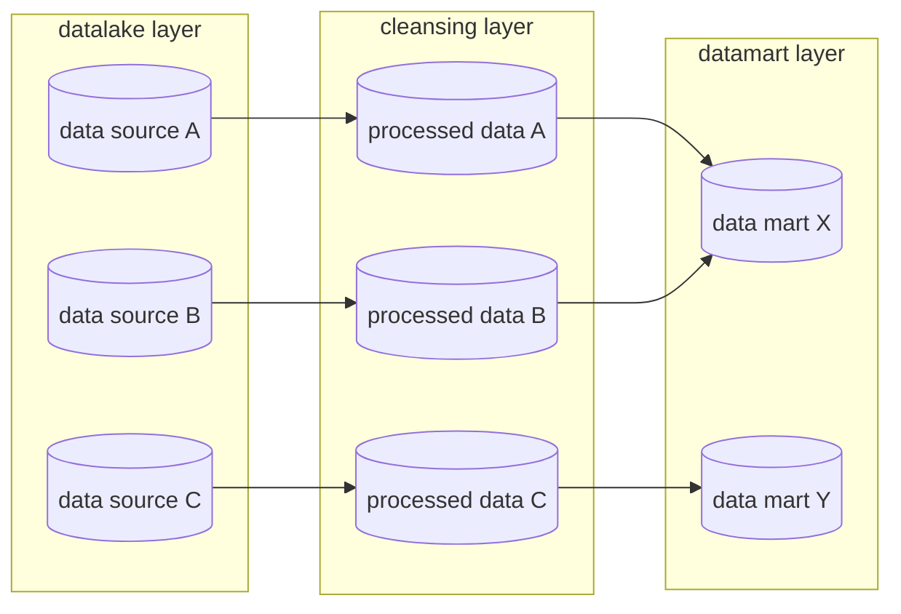

# Orbit Wars: Kaggle Bot Competition

Kaggle [Orbit Wars](https://www.kaggle.com/competitions/orbit-wars) 参戦リポジトリ。1v1 / 4人FFA のリアルタイム戦略シミュレーション上で対戦する **AIエージェント** を開発します。

## 大会概要

- **主催**: Kaggle (Bovard Doerschuk-Tiberi, Walter Reade, Addison Howard)
- **種別**: Featured Simulation Competition
- **賞金総額**: $50,000（1〜10位にそれぞれ $5,000）
- **目的**: 2010年の Planet Wars を現代化した対戦ゲームで、他参加者のボットと対戦し勝率を最大化する

### エージェントに求められる能力

| 能力 | 説明 |
|------|------|
| **盤面認識** | 惑星・フリート・コメット・軌道運動を解釈 |
| **行動選択** | 1ターン1秒以内に `[from_planet_id, angle, num_ships]` のリストを返す |
| **軌道予測** | 軌道惑星（公転）とコメット（直線移動）の将来位置を予測 |
| **戦闘判定** | グループ化された戦闘ルールを踏まえて勝敗と占領を推定 |

## ゲームルール概要

- **ボード**: 100×100 の連続2D空間、中心 (50,50) に半径10の太陽（通過したフリートは消滅）
- **惑星**: 20〜40基。4折対称配置で、軌道惑星は 0.025〜0.05 rad/turn で公転
- **コメット**: ターン 50/150/250/350/450 に4つ1組で出現、速度 4.0
- **勝利条件**: 500ターン終了時、または相手全滅時に `自軍惑星の艦数 + 飛行中フリートの艦数` が最大のプレイヤーが勝利
- **戦闘**: 攻撃者をowner別にグループ化し、最大勢力vs第2勢力の差分が駐留艦と対戦

詳細は [`docs/competition/abstract.md`](docs/competition/abstract.md) を参照。

## 大会スケジュール

| 日程 (UTC 23:59) | イベント |
|------------------|---------|
| 2026-04-16 | 開始 |
| 2026-06-16 | エントリー / チームマージ締切 |
| 2026-06-23 | 最終提出締切 |
| 2026-06-24 〜 07-08 頃 | 追加対戦期間（収束まで継続） |

### 評価方式

各提出は **ガウス分布 N(μ, σ²)** のスキルレーティングを持ち、対戦結果で更新される。

- 初期値 μ₀ = 600、対戦を重ねると σ が縮小
- 更新は勝敗のみを参照（スコア差は無関係）
- 1日最大5提出、最新2件が最終提出候補

> **注意**: 勝率・スキルレーティングは他参加者の提出物との **相対評価** であり、対戦相手プールが時間とともに変化するため、同一エージェントでも提出タイミングにより publicScore が大きく変動する。よって **エージェントの優劣はローカル対戦実績 (自己対戦・ローカル head-to-head) のみで評価し、Kaggle publicScore / スキルレーティングは判断材料に用いない**。

## Technology Stack

- **Language**: Python 3.13
- **Simulator**: `kaggle-environments` (Orbit Wars env)
- **Numerics**: NumPy, Pandas, Polars
- **AI / RL**: PyTorch / Stable-Baselines3 など（必要に応じて導入）
- **Testing**: Pytest + pytest-cov, Ruff, Mypy
- **Package Management**: UV

## Folder Structure

```
backend/                Python 実装一式 (pyproject.toml / uv.lock はここに配置)
  src/
    dataset/            対戦ログ管理 (selfplay 実行 + Kaggle scraper + storage)
      schema/           MatchRecord 等のドメイン型
      storage/          parquet 書き出し・読み出し・分析
      selfplay/         kaggle-environments ラッパー・自己対戦 runner
      kaggle/           Kaggle EpisodeService scraper
    submit/             Kaggle 提出の archive / validator / uploader
  pipeline/
    rulebase/           ルールベース戦略パイプライン
      case0/            単純スナイパー (参考実装)
      case1/            baseline_v1
        eda/            観測データの探索的分析
      case2/            baseline_v2
    imitation/          模倣学習パイプライン
      case1/            DeepSets BC
  tests/                Pytest unit tests
infra/                  Terraform によるインフラ管理 (AWS 等)
  environment/          環境別 root module (dev / staging / prod)
    dev/
  module/               再利用可能な共有モジュール
data/                   3 層構造 (gitignore / メインリポジトリへの symlink)
  lake/                 生データ層
    selfplay/matches/   self-play リプレイ・index
    kaggle_episodes/matches/  Kaggle 上位リプレイ・index
  processed/            クレンジング層
  mart/                 集計済み層 (学習向け parquet)
    imitation/case1/    imitation/case1 (DeepSets BC) 用 train/val.parquet
  submissions/          Kaggle 提出アーカイブ
dev/                    Development scripts
  setup                 Install dependencies (uv sync)
  format                Code formatting (ruff)
  lint                  Static analysis (ruff + mypy)
  test-backend          Backend CI (format check -> lint -> type check -> pytest)
  create-worktree       Create git worktree with .env copy
docs/
  competition/          コンペ仕様まとめ（abstract.md 等）
  plans/                Feature plans
  research/             Research prompts and outputs
```

Python コマンドは `backend/` 配下で `uv run ...` として実行するか、`dev/*` スクリプト経由で呼び出してください（スクリプトは内部で `cd backend` します）。

## Commands

```bash
dev/setup            # Install dependencies (uv sync)
dev/format           # Code formatting (ruff)
dev/lint             # Static analysis (ruff + mypy)
dev/test-backend     # CI (format check -> lint -> type check -> pytest)
dev/create-worktree  # Create git worktree with .env copy
dev/dvc              # DVC operations (setup / pull / repro / push / dag / add)
```

## Data / Model Management (DVC)

学習データ・前処理済み parquet・モデル重み・評価メトリクスは **DVC + S3** で版管理します。
Git はコードと `dvc.yaml` / `dvc.lock` / `params.yaml` を追跡し、実データ本体は S3 に push/pull します。

### 初回セットアップ

```bash
# 1) AWS CLI に orbit-wars プロファイルを用意しておく (infra/environment/dev で作成した IAM user の key)
# 2) リポジトリ側のローカル設定 (cache 共有 + profile)
dev/dvc setup

# 3) データ取得 (S3 remote から)
dev/dvc pull
```

### Pipeline 再実行 (`dvc repro`)

```bash
dev/dvc repro                            # 全 stage 依存グラフで差分再実行
dev/dvc repro preprocess_imitation_case1 # 単 stage
dev/dvc dag                              # DAG 描画
dev/dvc status                           # 差分一覧
```

変更した成果物を S3 に共有:

```bash
uv run --directory backend dvc push
git add dvc.lock params.yaml data/mart/imitation/case1/eval_metrics.json
git commit -m "..."
```

Stage 定義は `dvc.yaml`、パラメータは `params.yaml`（Python CLI は `--config` を持たず params.yaml を固定読み）。

### ローカル対戦履歴 (`data/lake/selfplay/matches/`)

selfplay runner が生成する 1v1 / FFA の対戦ログ (index.parquet + replays/) は `dvc add` でディレクトリ単位に track しています。`.dvc` メタファイル (`data/lake/selfplay/matches.dvc`) のみ git で追跡され、実データは S3 remote に push します。

```bash
# selfplay 実行 (自動で dvc add を走らせる場合)
cd backend
uv run python -m dataset run --agents baseline_v1,case0 --mode 1v1 -n 100 --dvc-add

# 手動で dvc add する場合
uv run --directory backend dvc add data/lake/selfplay/matches

# 変更を共有
git add data/lake/selfplay/matches.dvc
git commit -m ":sparkles: selfplay: N 件追加"
uv run --directory backend dvc push
```

別 worktree や clean clone から復元するには `dvc pull data/lake/selfplay/matches.dvc` を実行します。Kaggle scraper が出力する `data/lake/kaggle_episodes/matches/` も同様に `dvc add` で管理されています。

> **注意**: `.dvc/cache` は worktree 間で共有 (`/Users/user/project/orbit-wars/.dvc/cache`) のため、複数 worktree で同時に `dvc add` / `dvc pull` を走らせると lock 競合する可能性があります。順次実行してください。

### インフラ (S3 bucket + IAM)

Terraform 管理。詳細は [`infra/environment/dev/README.md`](infra/environment/dev/README.md) を参照。

## Evaluation Framework (`backend/src/dataset/`)

ローカルでの対戦実行・データ蓄積・分析・再生、および Kaggle 上位リプレイの取得を提供する汎用フレームワーク。以下のコマンドは `backend/` ディレクトリ配下で実行します。

```bash
cd backend

# 自己対戦実行 (結果は data/lake/selfplay/matches/ に保存)
uv run python -m dataset run \
  --agents baseline_v1,case0 --mode 1v1 -n 10 --parallel 4

# 最新 10 件を一覧
uv run python -m dataset list --mode 1v1 --limit 10

# 指定 match_id のリプレイを検査
uv run python -m dataset replay-inspect <match_id>

# Kaggle 上位リプレイをスクレイプ (data/lake/kaggle_episodes/ に保存)
uv run python -m dataset kaggle scrape --top 20 --modes 1v1,ffa4
```

- **データ**: Parquet (hive partition: `mode=`) に指標、`replays/{match_id}.json.gz` に env.toJSON。
- **分析**: `dataset.storage.analyze.agent_winrate(...)` / `timing_distribution(...)` / `mode_summary(...)` を呼ぶ。
- **可視化**: `backend/pipeline/rulebase/case1/eda/replay_viewer.py` を Jupyter / VS Code で開き、`env.render("ipython")` を実行。

## Glossary

| Term | Description |
|------|-------------|
| Orbit Wars | Kaggle主催のシミュレーション対戦コンペ（Planet Wars の現代版） |
| Planet | 盤面上の惑星。軌道惑星（公転）と静止惑星がある。生産量 1〜5 |
| Fleet | `[id, owner, x, y, angle, from_planet_id, ships]` 形式の飛行中艦隊 |
| Comet | ターン 50/150/.../450 に出現する移動惑星。占領・生産可能 |
| Home Planet | 各プレイヤーの初期所有惑星（初期艦数10） |
| Skill Rating | 提出ごとのガウス分布 N(μ, σ²) によるレーティング |

## data processing flow

|   layer   |    directory     | description                                                                                                                                          |
| :-------: | :--------------: | :--------------------------------------------------------------------------------------------------------------------------------------------------- |
| datalake  |   `data/lake`    | 整備されていない生データを配置する.                                                                                                                  |
| cleansing | `data/processed` | 生データから必要な情報を落とさずにクレンジング（欠損補完や異常値処理など）した前処理済みデータを配置する。                                           |
| datamart  |   `data/mart`    | クレンジング層のデータに対して集約や結合、カラムの追加などを行い、分析に利用する形に整形したデータを配置する。重要な集計ロジックはここに集約させる。 |




## Links

- [Kaggle: Orbit Wars](https://www.kaggle.com/competitions/orbit-wars)
- [コンペ概要まとめ](docs/competition/abstract.md)
